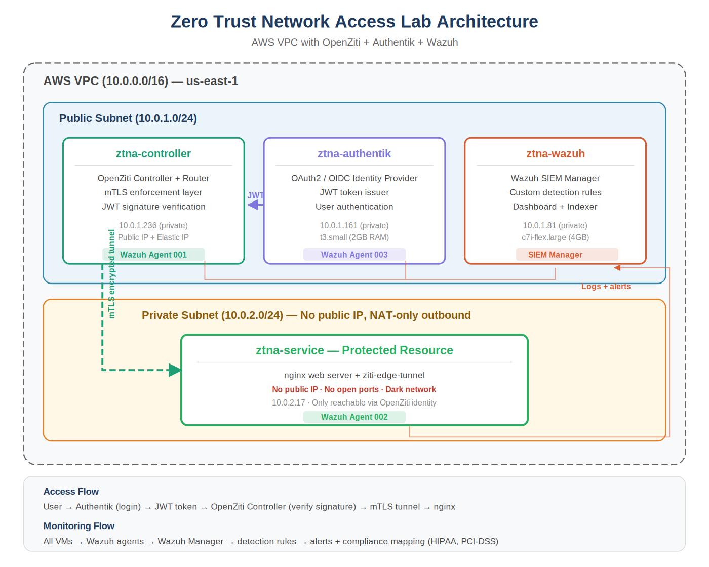
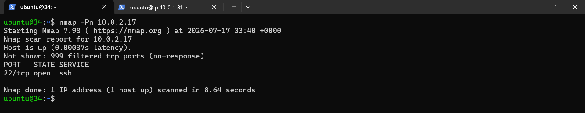
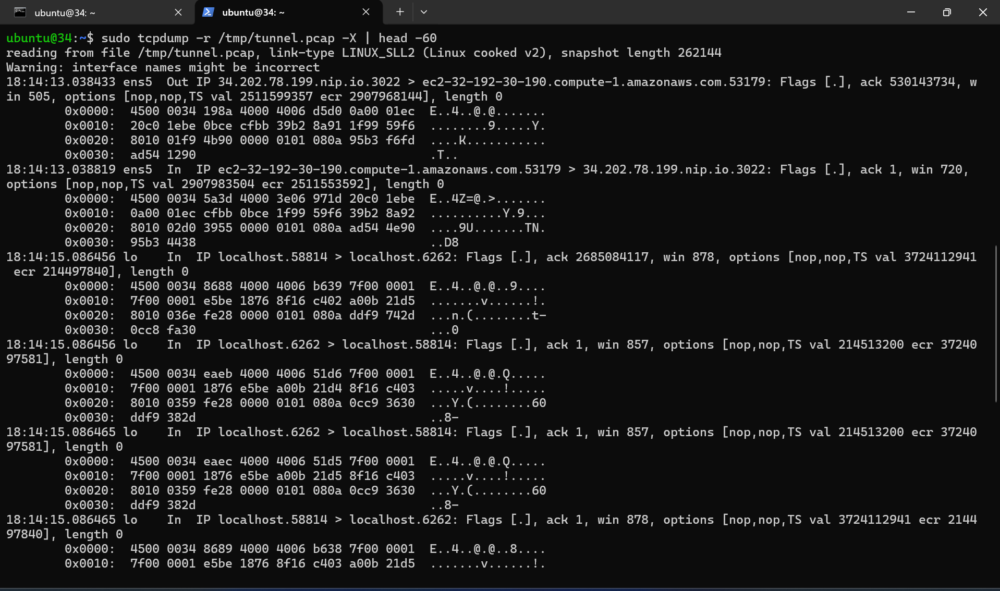
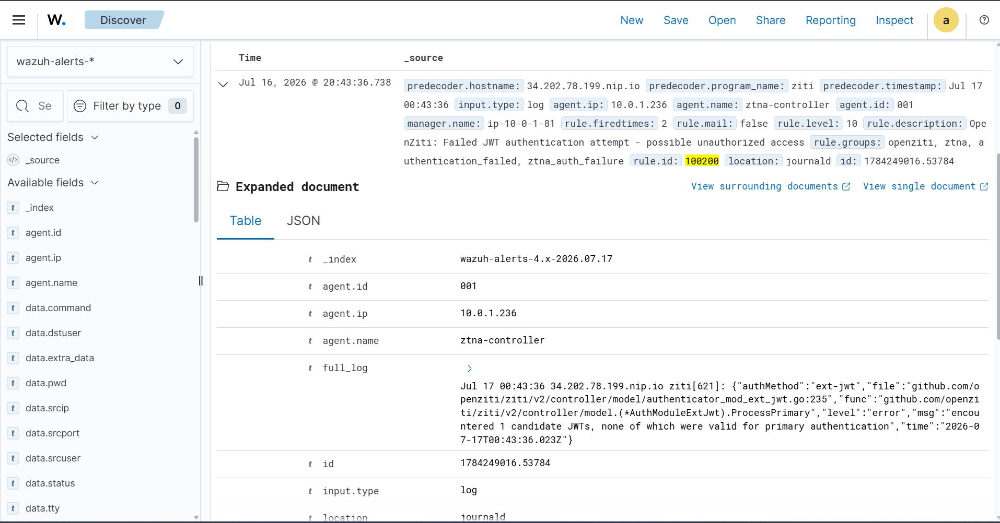
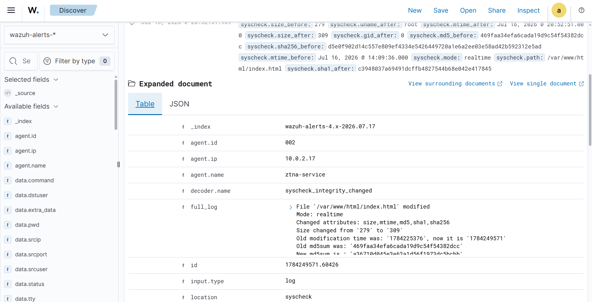
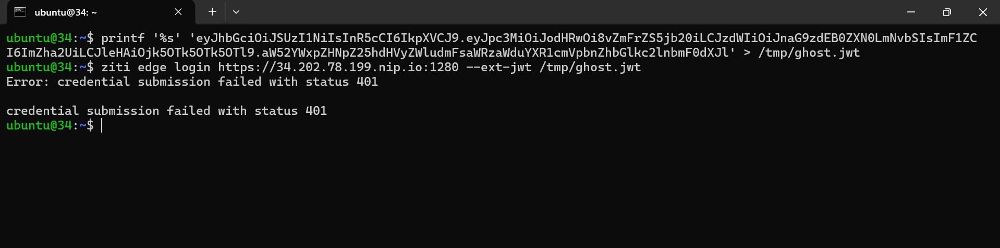
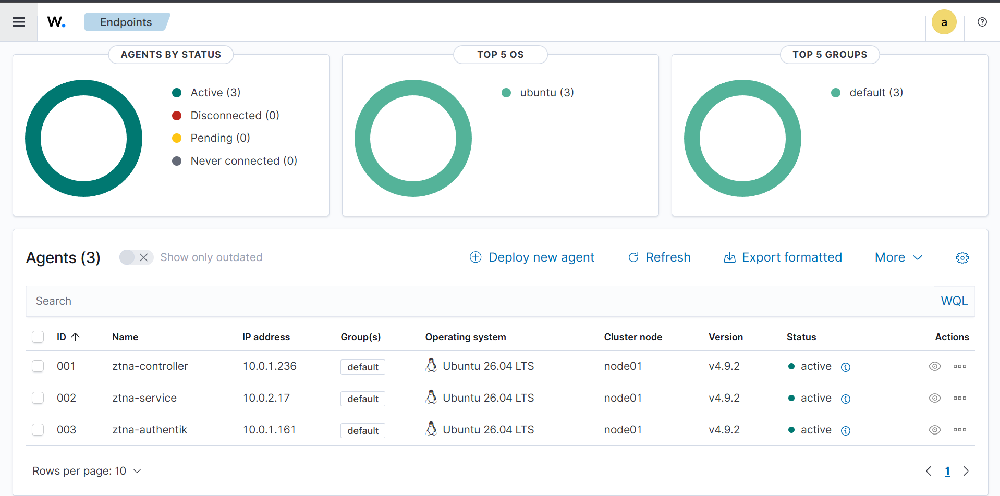
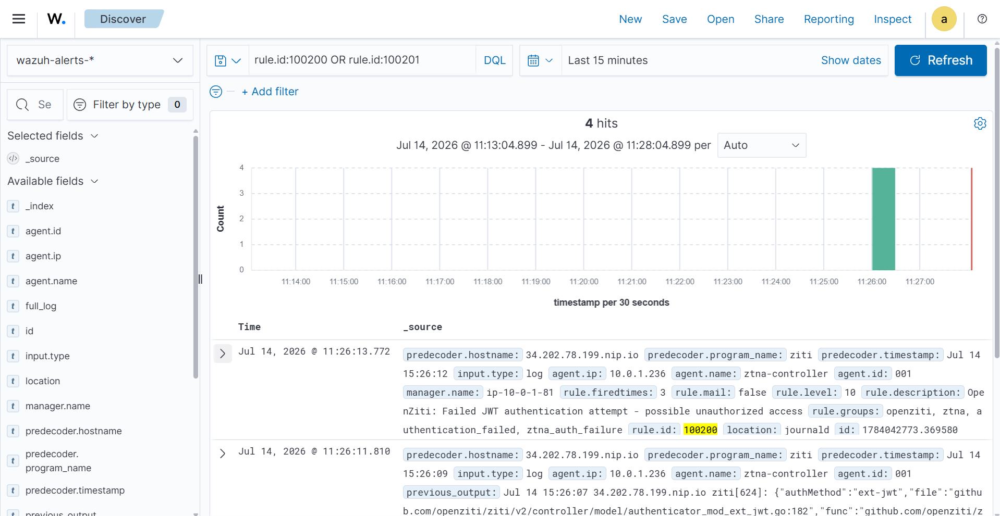

# Zero Trust Network Access Lab

A production-grade Zero Trust Network Access (ZTNA) architecture built on AWS, implementing identity-based microsegmentation, OAuth2/OIDC federation, continuous SIEM monitoring, and validated through systematic attack simulation using the STRIDE threat model.

**Author:** Rahul Rajkumar Kori
**M.S. Cybersecurity Risk Management** — Indiana University Bloomington, May 2026
**Timeline:** July 2026 | **Status:** Complete — Build + Attack Validation

---

## What This Project Demonstrates

This isn't a tutorial follow-along. It's a working zero trust architecture that I designed, built, defended, and then attacked to prove it works.

- **Built** a complete ZTNA fabric using open-source tools that mirror enterprise products
- **Federated** an OIDC identity provider with the ZTNA controller (same pattern as Okta + Zscaler)
- **Deployed** a SIEM with custom detection rules for zero-trust-specific events
- **Validated** the architecture by executing 5 attacks across 3 STRIDE categories — every attack blocked, every attack detected

---

## Architecture



Four VMs across two subnets. The protected service sits in a private subnet with no public IP and no open ports. All access flows through OpenZiti's mTLS fabric after JWT verification against Authentik. Every VM is monitored by Wazuh agents reporting to a central SIEM manager.

---

## Tech Stack

| Tool | Role | Enterprise Equivalent |
|---|---|---|
| **OpenZiti** | ZTNA Controller + Router | Zscaler Private Access / Cloudflare Access |
| **Authentik** | Identity Provider (OAuth2/OIDC) | Okta / Azure AD (Entra ID) |
| **Wazuh** | SIEM + Continuous Monitoring | Splunk / Microsoft Sentinel |
| **nginx** | Protected Service | Internal Enterprise Application |
| **AWS VPC** | Cloud Infrastructure | Enterprise Private Cloud |

---

## The Zero Trust Principles Validated

Every NIST 800-207 principle was tested with real attacks:

| Principle | Implementation | Attack Test | Result |
|---|---|---|---|
| **Verify Explicitly** | mTLS + OIDC federation | CLI Forged JWT, JWT Claims Modification | Both blocked |
| **Least Privilege** | OpenZiti Dial/Bind policies | Dark Network Reconnaissance | Service invisible |
| **Assume Breach** | Wazuh SIEM + custom rules | JWT Claims Modification, Web Content Tampering | Detected in seconds |

---

## Proof — Attack Simulation Results

Systematically executed using the STRIDE threat model. Every attack blocked. Every attack detected where applicable.

### Dark Network Reconnaissance (Information Disclosure)

The strongest single proof of zero trust in the entire project. From an insider position (SSH access to the controller VM), I ran nmap to find the protected nginx service. Result: **999 filtered ports, only SSH visible. nginx is invisible.**



Traditional firewalls block traffic — attackers still see something is being blocked. Zero trust makes services *disappear*. There's nothing to block because there's nothing listening.

---

### Tunnel Traffic Capture (Tampering / Information Disclosure)

I ran tcpdump on the controller with root access — full packet capture on the machine that brokers the OpenZiti tunnel. Then I made legitimate requests through the tunnel. Result: **all payload encrypted. No readable HTTP, no HTML, no application data leaked.**



mTLS provides real confidentiality even against a fully-compromised insider. This is the guarantee enterprises pay Zscaler and Cloudflare for.

---

### JWT Claims Modification (Tampering)

I crafted a JWT with tampered claims (fake email, fake subject) and submitted it to OpenZiti. Result: **rejected with 401 AND detected by custom Wazuh rule 100200 with severity level 10.**



Cryptographic signatures make claim tampering mathematically impossible. And the SIEM caught the attempt with full attribution — source, agent, severity, and rule groups (openziti, ztna, authentication_failed).

---

### Web Content Tampering (Tampering)

I modified nginx's index.html on the service VM to simulate an attacker with root access defacing the website. Result: **Wazuh File Integrity Monitoring detected within seconds, capturing before/after MD5 and SHA256 hashes for forensic evidence.**



Even total host compromise doesn't allow silent tampering. Every file change is captured with cryptographic proof.

---

### CLI Forged JWT Authentication (Spoofing)

I forged a JWT token and submitted it through the official ziti CLI (the same tool a legitimate user would use). Result: **401 credential submission failed.**



The defense holds regardless of which tool the attacker uses. Signature verification happens server-side — the client is never trusted.

---

## Additional Detection Proof

Wazuh SIEM caught real security events across the infrastructure — not just simulated attacks. All three agents (controller, service, authentik) actively reporting:



Custom detection rule 100200 firing on OpenZiti JWT authentication failures with automatic HIPAA and PCI-DSS compliance mapping:



---

## Key Results

### Zero Trust Enforcement
- **Direct access** to nginx → Connection timed out (BLOCKED)
- **OpenZiti access** with valid identity → Page loads (ALLOWED)
- **Insider port scan** → 999 filtered ports, nginx invisible (DARK NETWORK)

### Identity Federation
- Authentik issues signed JWT with correct claims (iss, aud, sub, email)
- OpenZiti configured as relying party with ext-jwt-signer pointing to Authentik JWKS
- Full OAuth2 authorization code flow validated end to end

### SIEM Detection
- Failed SSH login detected with source IP, username, severity, and compliance mapping
- Custom rule 100200: OpenZiti JWT authentication failure (level 10)
- Custom rule 100201: Multiple failures in 120 seconds — brute force indicator (level 12)
- File Integrity Monitoring caught nginx content tampering within seconds
- All events mapped to HIPAA, PCI-DSS, and NIST compliance frameworks

---

## Project Progression

| Phase | Focus | Status |
|---|---|---|
| Concepts | NIST 800-207, mTLS, OAuth2/OIDC, STRIDE, IGA | Complete |
| Infrastructure | AWS VPC + OpenZiti installation | Complete |
| Enforcement | Protected service + zero trust proof | Complete |
| Identity | Authentik IdP + OAuth2/OIDC federation | Complete |
| Monitoring | Wazuh SIEM + agents + custom detection rules + FIM | Complete |
| Validation | STRIDE threat model + attack simulation | Complete |

Full daily documentation for each phase is in the `Progress/` folder.

---

## NIST 800-207 Alignment

The project implements all seven NIST zero trust tenets:

1. **Everything is a resource** — every VM and service is protected
2. **All communication secured regardless of location** — mTLS encryption everywhere
3. **Access is per session** — each connection verified independently
4. **Access determined by dynamic policy** — OpenZiti role-based policies
5. **Monitor all assets continuously** — Wazuh agents on every VM
6. **Authentication strictly enforced** — Authentik OIDC + OpenZiti certificate validation
7. **Collect everything, improve continuously** — Wazuh log collection + custom rules

---

## Repository Structure

```
zero-trust-network-lab/
|-- README.md
|-- Progress/
|   |-- Day1_Concepts_Foundation.docx
|   |-- Day2_AWS_OpenZiti.docx
|   |-- Day3_Protected_Service_ZT_Enforcement.docx
|   |-- Day4_Authentik_Identity_Provider.docx
|   |-- Day5_Wazuh_SIEM_Monitoring.docx
|   |-- STRIDE_And_Attacks.docx
|-- configs/
|   |-- wazuh-custom-rules.xml
|-- screenshots/
    |-- architecture-diagram.png
    |-- spoofing-cli-forged-jwt.png
    |-- tampering-tunnel-traffic-capture.png
    |-- tampering-jwt-claims-modification.png
    |-- tampering-web-content-modification.png
    |-- infodisclosure-dark-network-recon.png
```

---

## Skills Demonstrated

- **Cloud Infrastructure:** AWS VPC, subnets, security groups, NAT Gateway, EC2
- **Zero Trust Architecture:** NIST 800-207, microsegmentation, dark network principle
- **Identity & Access Management:** OAuth2, OIDC, JWT validation, JWKS, claims mapping
- **Network Security:** mTLS, certificate-based authentication, identity-based access
- **SIEM & Monitoring:** Wazuh deployment, agent management, custom detection rules, FIM
- **Identity Federation:** Authentik to OpenZiti trust via ext-jwt-signer
- **Offensive Security:** STRIDE threat modeling, nmap, tcpdump, JWT tampering
- **Compliance:** HIPAA, PCI-DSS, NIST 800-53 mapping via automated SIEM alerts
- **Documentation:** Structured technical writing with proof at every step

---

## Note on Lab Availability

The AWS infrastructure for this lab has been decommissioned to control costs. The architecture is fully documented, all attack results are captured with screenshots, and the entire build is reproducible from the documentation and configurations in this repository. Rebuild time from documentation: approximately 8-10 hours.

---

## Contact

**Rahul Rajkumar Kori**
- GitHub: [github.com/Rahul7259](https://github.com/Rahul7259)
- Email: rkori@iu.edu
